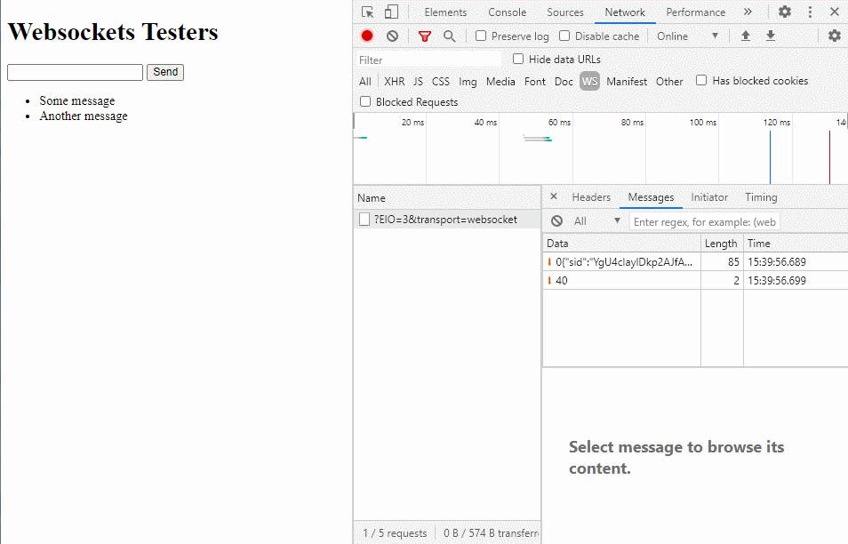

# Hello Socket.io

As a demo project for practicing socket.io.

## Skill

- server
  - [Nestjs](https://nestjs.com/) version 7.5.1
  - Gateways
  - @nestjs/websockets
  - @nestjs/platform-socket.io
  - @nestjs/platform-express
- client
  - [socket.io](https://socket.io/docs/v3/client-api/)
  - [Vue.js](https://vuejs.org/v2/guide/installation.html) cdn 2.6.12

## Event

```
socket.on(<event>:string, message=>{})
```

## Messaging
```
socket.emit(<event>:string, message)
```

## Result

